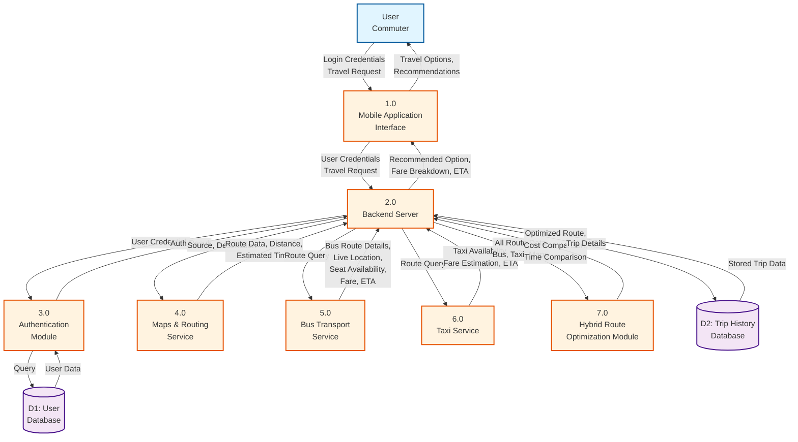

# Level 1 DFD - Mermaid Format
## Efficient Urban Commute Hub via Hybrid Bus and Taxi Booking

This Mermaid diagram can be rendered in:
- GitHub/GitLab markdown
- VS Code with Mermaid extension
- Online Mermaid editor: https://mermaid.live

## Legend
- **Rectangles (Blue)**: External Entities
- **Rounded Rectangles (Orange)**: Processes
- **Cylinders (Purple)**: Data Stores
- **Arrows**: Data Flows (labeled)

